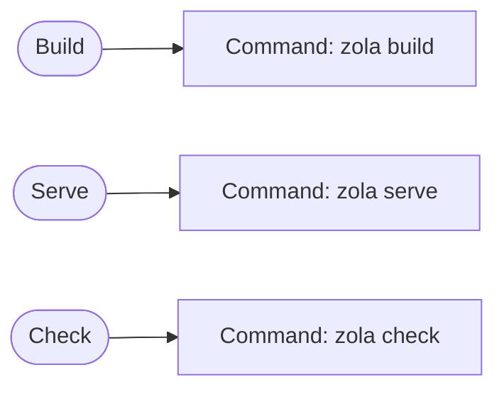

Book Template is a starter template of [Zola][zola] with [book][book] theme, including automatic publishing feature to [GitHub Pages][github-pages].

## Requirements

Please install the following requirements.

- [Zola][zola]

### Editor

The recommended editor is [Visual Studio Code][visual-studio-code].

## Usage

Please see the `content` directory.

### Workflows

First, please update the `base_url` in `config.toml`.

### Automatic Publishing

Please enable GitHub Pages in your GitHub repository settings.

## License

This template is licensed under [CC0][cc0].

[zola]: https://www.getzola.org/
[book]: https://github.com/getzola/book
[github-pages]: https://pages.github.com/
[visual-studio-code]: https://code.visualstudio.com/
[cc0]: https://creativecommons.org/public-domain/cc0/
